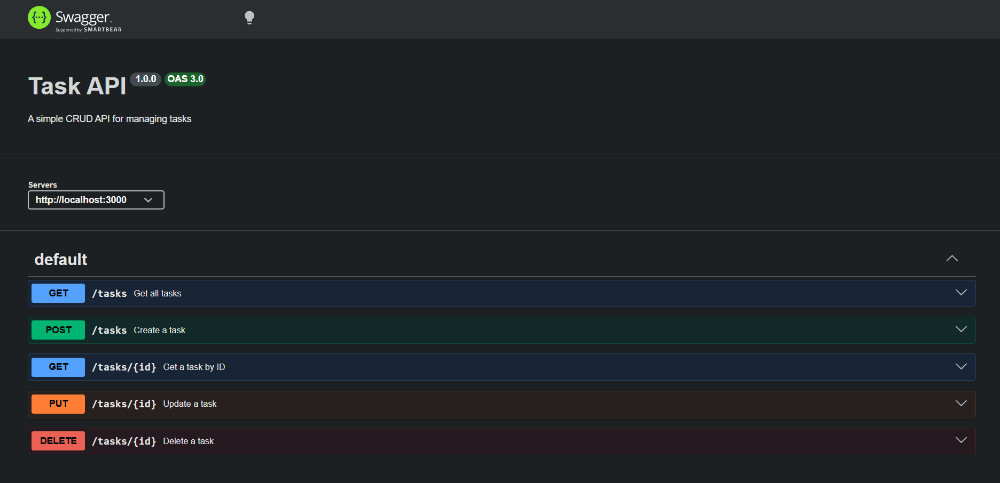

# Task API

A simple REST API for managing a to-do list using Node.js and Express.

This project demonstrates the four CRUD operations:

- Create tasks
- Read tasks
- Update tasks
- Delete tasks

The API stores tasks **in memory**, so the data resets whenever the server restarts.

## Installation

Clone the repository:

```bash
git clone https://github.com/Paras045/crud-api.git
cd crud-api
```

Install the dependencies:

```bash
npm install
```

Start the server:

```bash
node server.js
```

The API will run at:

`http://localhost:3000`

Swagger documentation is available at:

`http://localhost:3000/docs`

## API Endpoints

| Method | Endpoint | Description |
|---|---|---|
| GET | `/` | Get API information |
| GET | `/health` | Check server health |
| GET | `/tasks` | Get all tasks |
| GET | `/tasks/:id` | Get a single task |
| POST | `/tasks` | Create a new task |
| PUT | `/tasks/:id` | Update a task |
| DELETE | `/tasks/:id` | Delete a task |

## Example Request

Get all tasks:

```bash
curl -i http://localhost:3000/tasks
```

Example response:

```text
HTTP/1.1 200 OK
Content-Type: application/json; charset=utf-8

[{"id":1,"title":"Learn JavaScript","done":false},{"id":2,"title":"Build CRUD API","done":false}]
```

The `200 OK` status confirms that the request was successful.

## Swagger UI

Interactive API documentation is available at:

`http://localhost:3000/docs`

Swagger UI provides a visual interface for testing all CRUD endpoints:

- Create a task with `POST /tasks`
- Read tasks with `GET /tasks`
- Update a task with `PUT /tasks/:id`
- Delete a task with `DELETE /tasks/:id`

### Swagger Screenshot



## CRUD Test Flow

The API was tested through both `curl` and Swagger UI.

The complete CRUD flow is:

1. **Create** — `POST /tasks` returns `201 Created`
2. **Read** — `GET /tasks` and `GET /tasks/:id` return `200 OK`
3. **Update** — `PUT /tasks/:id` returns `200 OK`
4. **Delete** — `DELETE /tasks/:id` returns `204 No Content`
5. Invalid or unknown tasks return `400 Bad Request` or `404 Not Found` as appropriate.

## Notes

- Tasks are stored in memory.
- Data is reset when the server restarts.
- No database is used in this assignment.
